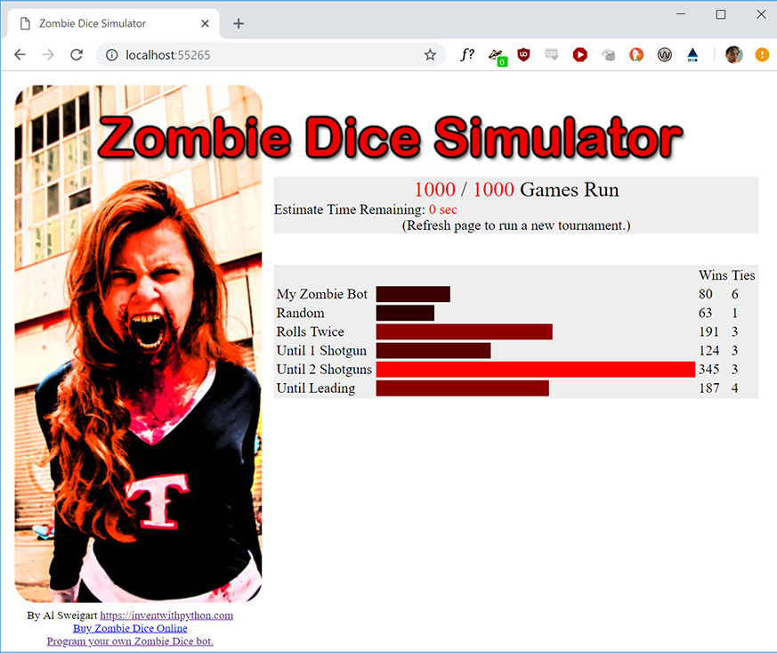

Zombie Dice Simulator
=====================

A simulator for the dice game Zombie Dice that can run bot AI players.

Zombie Dice is a quick, fun dice game from Steve Jackson Games. The players are zombies trying to eat as many human brains without getting “shotgunned” by the humans. On their turn, a player will randomly select three dice from a cup of thirteen dice and roll them. The die faces are brains, footsteps, and shotguns. You get one point per brain, but if you roll a cumulative three shotguns, you’ve been shotgunned and get zero points for your turn. You can then decide to re-roll or pass your turn to the next player. If a die came up as “footsteps”, it’s used again if the player decides to re-roll. (The player always uses three dice for each roll.) Zombie Dice has a “push your luck” game mechanic: the more times you choose to re-roll the dice, the more brains you can get but the more likely you’ll collect three shotguns. The game continues until a player reaches 13 brains, and then the rest of the players get one more turn. The dice are colored green (brains are more likely), red (shotguns are more likely), and yellow (brains and shotguns are even).

More complete rules for Zombie Dice can be found here:

* `PDF of the rules in English <http://www.sjgames.com/dice/zombiedice/img/ZDRules_English.pdf>`_
* `Animated Flash demo of how to play <http://www.sjgames.com/dice/zombiedice/demo.html>`_
* `Instructables article with the rules <https://www.instructables.com/id/How-to-play-Zombie-Dice/>`_
* `YouTube video of someone explaining the rules <https://www.youtube.com/watch?v=xodehimqCVs>`_

This simulator is useful for beginner/intermediate programming lessons or contests. The API for making bots is simple, and it features a web UI for projecting a nifty display of the tournament as it runs.

Quickstart
----------

To install, run the usual ``pip install zombiedice`` (on Windows) or ``pip3 install zombiedice`` (on macOS/Linux).

You can view a demo with some pre-made bots by running ``python -m zombiedice`` (on Windows) or ``pip3 install zombiedice`` (on macOS/Linux).

Alternatively, you can run ``import zombiedice; zombiedice.demo()``

First, you need to create your own zombie. This is done by creating a class that implements a ``turn()`` method (called when it is your zombie's turn). The ``turn()`` method either calls the ``zombiedice.roll()`` function if you want to roll again, or returns to signal the end of their turn. The ``turn()`` method accepts one argument of the game state (documented later on this page). This class should also have a ``'name'`` attribute that contains a string of the player name. (This is so that the same class can be used for multiple players in a game.)

The ``zombiedice.roll()`` function returns a list of dictionaries. The dictionaries represent the dice roll results; it has a ``'color'`` and ``'icon'`` keys, which have possible values of ``'green'``, ``'yellow'``, ``'red'`` and ``'shotgun'``, ``'brains'``, and ``'footsteps'`` respectively. The list will contain three of these dictionaries for the three dice roll results. If the player has reached three shotguns or more, this list will be empty.

Here's an example of a zombie that keeps rolling until they've reached two shotguns, then stops. More example zombies can be found in *examples.py* in the *zombiedice* package::

    class StopsAt2ShotgunsZombie(object):
        """This bot keeps rolling until it reaches 2 shotguns."""
        def __init__(self, name):
            self.name = name

        def turn(self, gameState):
            shotgunsRolled = 0
            while shotgunsRolled < 2:
                results = roll()

                if results == []:
                    # Zombie has reached 3 or more shotguns.
                    return

                for i in results:
                    # Count shotguns in results.
                    if i[ICON] == SHOTGUN:
                        shotguns += 1

Next, you need to run a tournament. Create a file that calls either ``zombiedice.runWebGui()`` (for the nice web GUI) or ``zombiedice.runTournament()`` (for the plain command line interface). A typical file will look like *demo.py* in the `repo <https://github.com/asweigart/zombiedice>`_::

    import zombiedice

    zombies = (
        zombiedice.examples.RandomCoinFlipZombie(name='Random'),
        zombiedice.examples.MonteCarloZombie(name='Monte Carlo', riskiness=40, numExperiments=20),
        zombiedice.examples.MinNumShotgunsThenStopsZombie(name='Min 2 Shotguns', minShotguns=2)
        # Add any other zombie players here.
    )

    # Uncomment one of the following lines to run in CLI or Web GUI mode:
    #zombiedice.runTournament(zombies=zombies, numGames=1000)
    zombiedice.runWebGui(zombies=zombies, numGames=1000)

Example Zombies
---------------

There are a few example zombies included with the module:

* ``zombiedice.examples.RandomCoinFlipZombie(name)`` - Randomly decides 50/50 whether to continue rolling or quit.
* ``zombiedice.examples.MinNumShotgunsThenStopsZombie(name, minShotguns)`` - Keeps rolling until it rolls the minimum number of shotguns specified.
* ``zombiedice.examples.MinNumShotgunsThenStopsOneMoreZombie(name, minShotguns)`` - Like MinNumShotgunsThenStopsZombie, except it will roll one more time.
* ``zombiedice.examples.HumanPlayerZombie(name)`` - Calls input() to let a human player play against the bots.
* ``zombiedice.examples.RollsUntilInTheLeadZombie(name)`` - Keeps rolling until they are in first place.
* ``zombiedice.examples.MonteCarloZombie(name, riskiness, numExperiments)`` - Does a number of monte carlo simulation (``numExperiments``) to determine what will happen if they roll again. As long as the percentage of simulations resulting in three shotguns is less than ``riskiness``, it will roll again.

TODO
----

More details about how this module works to come.